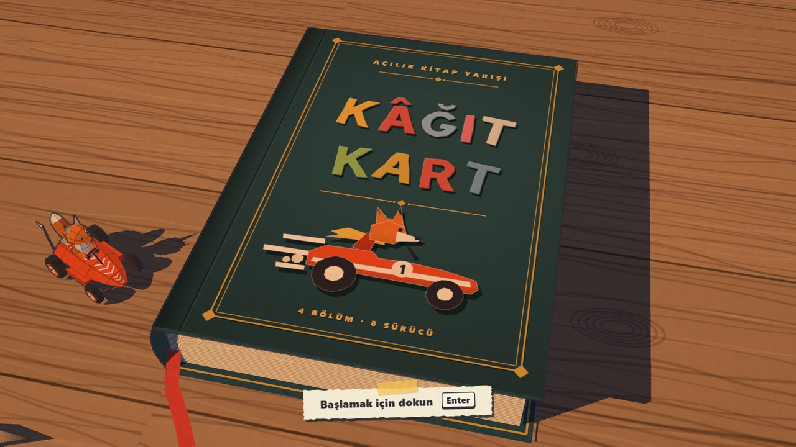
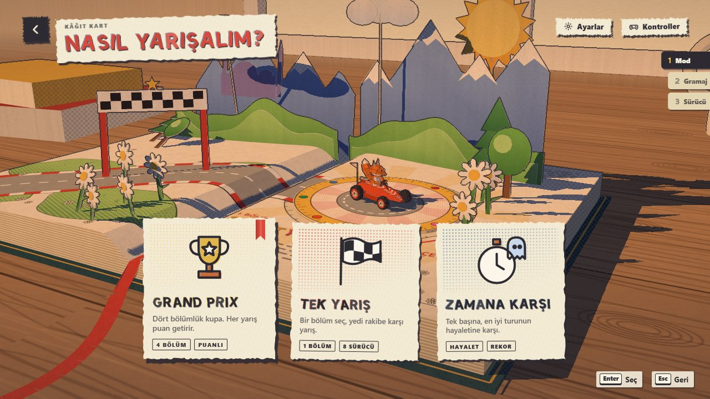
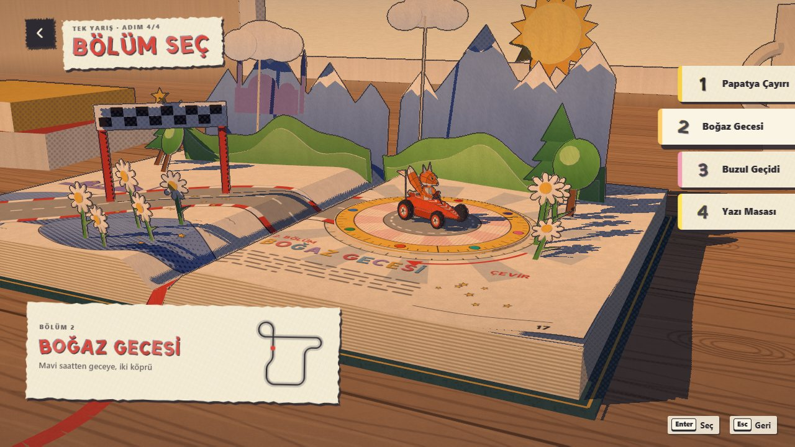
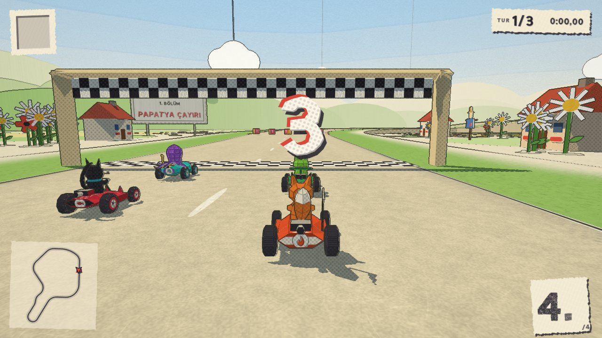
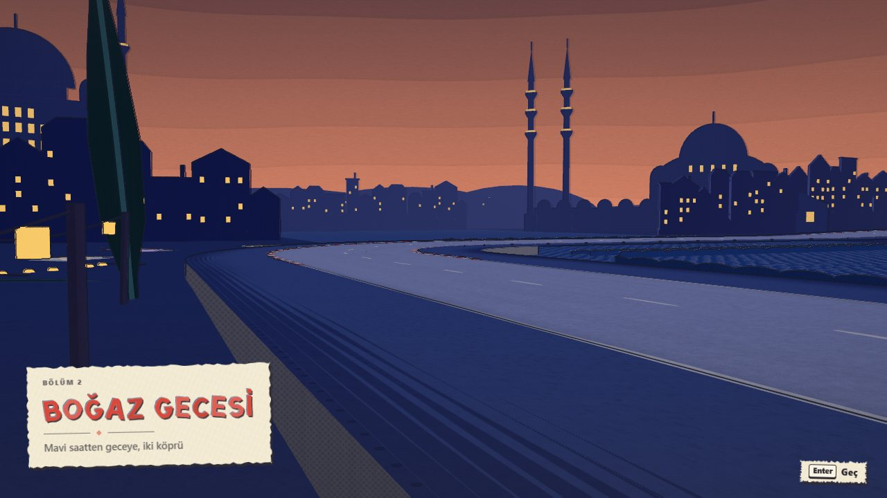
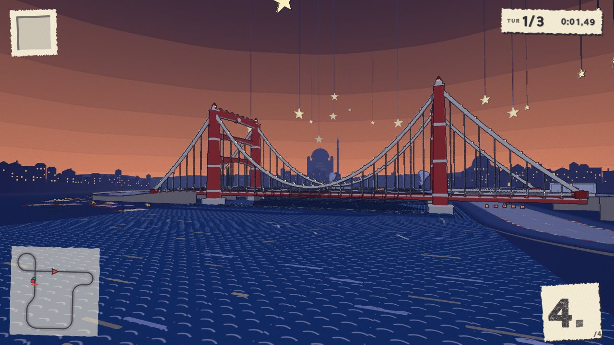
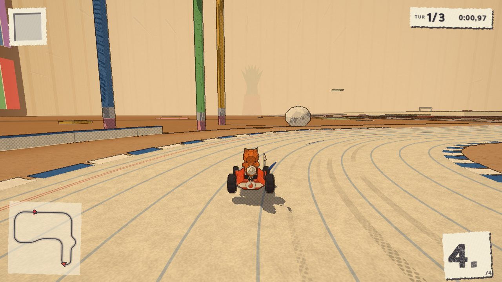
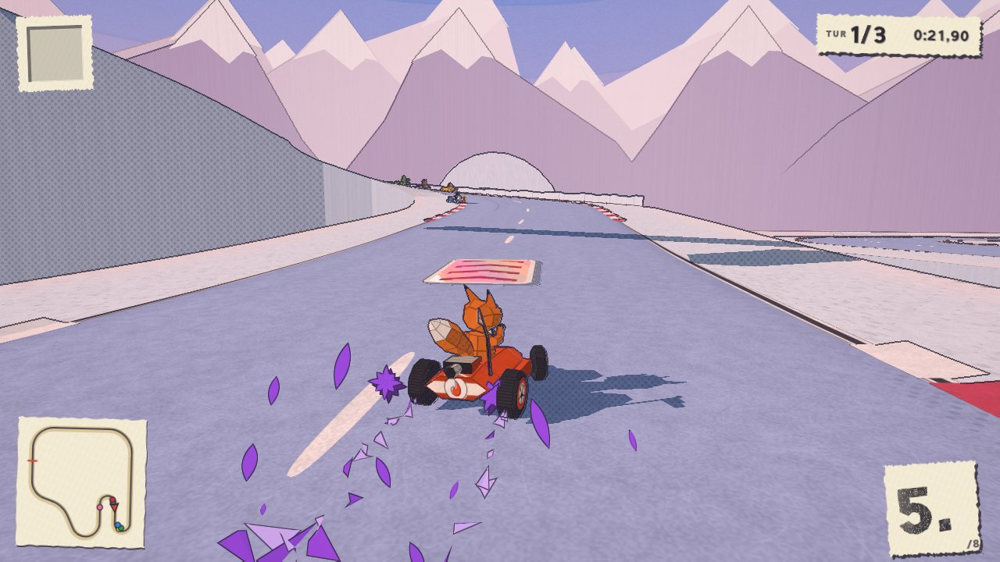
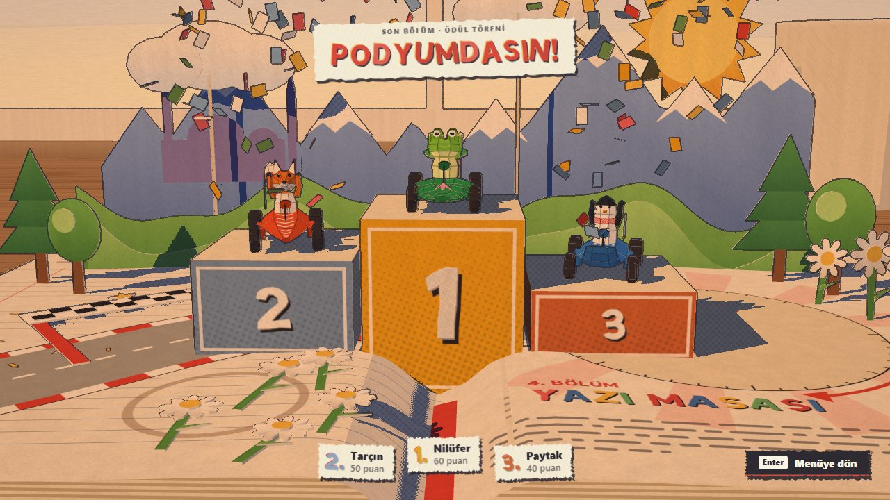

# Kâğıt Kart

**A kart racer that takes place inside a pop-up book.** The scenery folds up out of the page as you drive toward it, and the karts, drivers and items are made of paper and stationery.

**[▶ Play it in your browser](https://burakerdemci.github.io/kagit-kart/)** (desktop or phone, keyboard, gamepad or touch)



**There is not a single asset file in this repository.** No images, textures, models, sounds, music or fonts. Every mesh, paper texture, cut-paper letter, sound effect and bar of music is generated by code at runtime. The one dependency is the three.js library, loaded from jsdelivr.

| | |
|---|---|
|  |  |
|  |  |
|  |  |
|  |  |

## What's in it

- **Four chapters**, each with its own print style:
  - *Papatya Çayırı*, a daisy meadow
  - *Boğaz Gecesi*, the Bosphorus at dusk, with a suspension bridge
  - *Buzul Geçidi*, a glacier pass with a void to fall into
  - *Yazı Masası*, a race across the writing desk itself, on a ruled-notebook road
- **Eight drivers** with their own stats: Tarçın the fox, Nilüfer the frog, Paytak the penguin, Pofuduk the bear, Kömür the cat, Pervane the owl, Havuç the rabbit and Mürekkep the octopus.
- **Eight items**: a fountain-pen rocket (single or three), bubble gum, a paper plane (straight or homing), an inkwell, a cellophane shield and scissors.
- **Three modes**: a four-chapter Grand Prix, a single race, and time trial against your own ghost.
- **Speed classes named after paper weights**: 80 g, 120 g and 200 g.
- **Drift boosts with three tiers**, plus slipstream, ramps with tricks, and rocket shortcuts across the infield. If you fall off the page, a paper crane carries you back.
- **A procedural soundtrack**: a sequencer plays a theme for each chapter, the tempo rises on the final lap, and every sound effect is synthesised.
- **Three quality levels.** All four tracks hold 60 fps on the high setting.

## Controls

| Action | Keyboard | Gamepad |
|---|---|---|
| Steer | ← → / A D | Left stick |
| Accelerate, brake | ↑ ↓ / W S | A or RT, B or LT |
| Drift (hold while steering) | Space / Shift | RB |
| Use item | X / E | X or LB |
| Look back | C | Y |
| Pause | Esc / P | Start |
| Mute | M | |

On a phone, the game shows on-screen controls.

## How it was made

This game is an experiment in what an AI coding agent can build when it has no limits. The owner, [Burak Erdemci](https://github.com/BurakErdemci), gave [Claude](https://www.anthropic.com/claude) (Opus 5.5, in Claude Code) a single brief: *"make a Mario Kart-like racing game in the browser, at the best level you can; tell me when you think it's worth showing"*. He set one rule: *everything must be generated by code, with no outside assets*.

Claude worked as the architect, and subagents wrote the code:

1. **The contract came first.** [`ARCHITECTURE.md`](ARCHITECTURE.md) fixes the module boundaries, the `game` object, the event list, the units, the physics numbers, the visual language and the performance budget. It also includes the amendments added as the build went on (§19).
2. **Feature lanes ran in parallel**: core engine, tracks and scenery, AI, items, audio, UI and lettering, FX, characters, cinematics, and the paper look. Each lane owned its own files.
3. **A QA agent played the whole game** and wrote up 27 issues.
4. **Five fix rounds followed**: balance and AI, road look and core, Bosphorus and tracks, first impression, and items/FX/audio. After each round the architect ran the automated playtest itself, looked at the screenshots, and only then committed.

It came to about 27,000 lines of JavaScript in 78 modules. The work ran from the evening of 22 September 2026 to the early hours of the 24th.

### The number that says it works

This was written down before the first commit:

> **An automated autopilot run finishes a 3-lap, 8-kart race on every track with 0 console errors, and the player's view renders at a mean of ≥ 60 fps** (RX 6750 XT, Chromium via Playwright).

`tools/playtest.mjs` measures it and prints one JSON line per track. Races are deterministic: the same seed gives the same race, to the millisecond.

## Run locally

```bash
python tools/serve.py 8765              # then open http://127.0.0.1:8765
node tools/playtest.mjs --port 8765 --tracks all   # needs Playwright
```

The code is plain ES modules with no build step. `index.html` is written as a page *body* only, because the original publishing host wraps it in its own skeleton. `tools/serve.py` applies the same wrapper locally, and `tools/pages.py` applies it for GitHub Pages.
